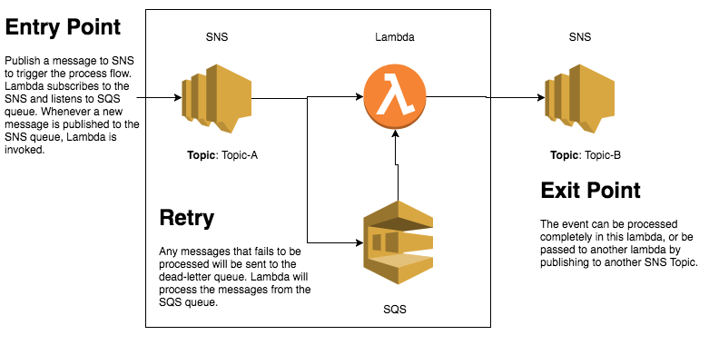

# Lambda architecture

Event-driven based messaging with Amazon Simple Notification Service (SNS), Amazon Simple Queue Service (SQS) and AWS Lambda.

## DEPRECATED

Note that while this method still works, you might want to consider setting SNS with Lambda Directly, without going through SQS. Also, do not forget to create a dead-letter-queue for your lambda.
